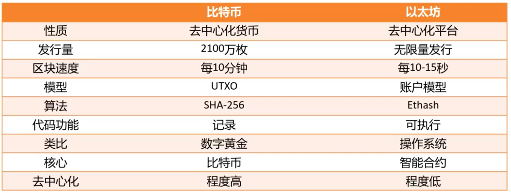

## 以太坊的野心

1.什么是以太坊

2.以太坊和比特币的比较

3.以太坊发展历程

4.以太坊的经济分析

---

#### 以太坊

下一代加密货币与去中心化应用平台

智能合约：自动执行合约条款的计算机程序，运行在不同的计算机结果要一致。可类比，自动售货机。

#### 与比特币的比较

比特币是去中心化货币

以太坊是去中心化平台

#### 应用

DeFi：Decentralized Finance 去中心化金融

本质上是智能合约，运行在以太坊等平台，不依赖券商、交易所、银行等中心化机构开展金融活动，借助密码学防止伪造和欺诈。

在边缘地带成长，目前只允许借贷、交易加密货币等。

#### 发展历程

四个阶段：边境（2015/7 - 2016/3）、家园（2016/3 - 2017/10）、都市（2017/10-2020/12）、宁静（2020/12-至今）

#### POW 和 POS

pos: proof of stake，是一类算法，相信那些持币多的人（相信有钱人）

工作原理：一个彩票系统，随机选出记账人。持币越多越可能被选中，概率跟持币数量成正比。 持币数量不是币的绝对数量，而是币的数量乘以持币时间，以天为单位，这样就得到一个新名 词“币天”。例如，张三有10个币持有了30天，李四有20个币持有了5天，则张三有300币天，而 李四只有100币天，张三被选中记账的概率更大。

两者比较：

pow是利用算力，pos利用投入，是不费电的

pow已经得到案例证明，pos还需要案例证明

pos问题

- 会造成贫富差距变大，富人越来越富。
- 它是通过系统内的币来达成共识，或者说是自己证明自己，都是无成本的。

#### 智能合约

**Not necessarily smart, but has to be automatic**

翻译为自动合约更准确

要素：自治、自足、去中心化

挑战：确定性、可终止性、执行关键（如何触发、预言机可信吗）

> 合约不完备理论

#### 以太坊的逻辑硬伤

以中心化的机构去管理去中心化的平台。

#### 推荐书籍

《数字货币与智能合约技术》，Arvind Narayanan等人著，林华，王勇译，中信出版社，2016年。
